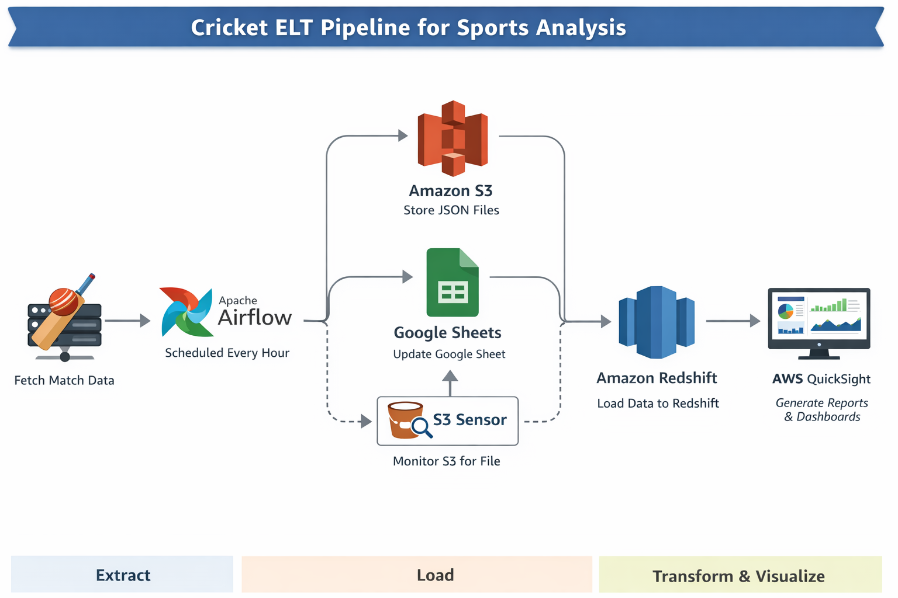

# 🏏 Cricket ELT Pipeline for Sports Analysis

An end-to-end ELT (Extract, Load, Transform) pipeline that automates cricket match data ingestion, storage, processing, and visualization using modern data engineering tools.

---

# 🚀 Project Overview

This project builds a fully automated data pipeline that:

- Extracts cricket match data from an API
- Loads raw data into AWS S3 in JSON format
- Stores structured data into Google Sheets in tabular format
- Loads data into Amazon Redshift for analytics
- Runs SQL-based transformations and queries
- Visualizes insights using AWS QuickSight
- Orchestrates workflows using Apache Airflow

---

---

# 🧠 Architecture

---

# ⚙️ Tech Stack

- Apache Airflow (Orchestration)
- Python (ETL scripts)
- Cricket API (Data source)
- AWS S3 (Raw JSON storage)
- Amazon Redshift (Data warehouse)
- Google Sheets API (Tabular storage)
- AWS QuickSight (Visualization)
- Docker (Containerization)

---

# 🔄 Pipeline Workflow (Step-by-Step)

## Step 1: Data Extraction (API Layer)
- Cricket match data is fetched using a public API
- Python `requests` library is used
- Data includes:
  - Match date
  - Teams
  - Venue
  - Match details

---

## Step 2: Load to AWS S3

- Raw data is stored in JSON format
- Each DAG run creates a new file
- S3 acts as a staging layer

---

## Step 3: Load to Google Sheets

- Data is converted into tabular format
- Stored using Google Sheets API
- Useful for quick validation and human-readable data

---

## Step 4: Load into Amazon Redshift

### Table Schema:

CREATE TABLE cricket_matches (
    match_date VARCHAR(50),
    team1 VARCHAR(100),
    team2 VARCHAR(100),
    venue VARCHAR(150)
);

---

### COPY Command:

COPY cricket_matches
FROM 's3://your-bucket-name/'
IAM_ROLE 'your-iam-role'
FORMAT AS JSON 'auto';

---

## Step 5: Orchestration using Airflow

- DAG runs hourly
- Tasks include:
  - API extraction
  - S3 upload
  - Google Sheets update
  - Redshift load
  - SQL execution
- Includes S3 sensor for event-based execution

---

## Step 6: Data Visualization using QuickSight

### Steps:
1. Connect QuickSight to Redshift
2. Select dataset
3. Create visuals:
   - Bar charts
   - Line charts
   - Pie charts
4. Analyze insights

---

# 📊 SQL Use Cases

- Total matches played
- Matches per team
- Venue-wise analysis
- Daily match trends
- Most frequent teams
- Top venues
- Match distribution over time
- Unique venues
- Team comparisons
- Time-based analytics

---

# 🐳 Docker Setup

Run Airflow using Docker:

docker-compose up

Access Airflow UI:

http://localhost:8080

---

# ▶️ How to Run the Project

Step 1: Clone repository  
git clone https://github.com/your-username/cricket-elt-pipeline.git  

Step 2: Install dependencies  
pip install -r requirements.txt  

Step 3: Configure credentials  
- AWS credentials  
- Google Sheets credentials.json  
- Redshift connection  

Step 4: Start Docker  
docker-compose up  

Step 5: Open Airflow UI  
- Enable DAG  
- Trigger pipeline manually or wait for schedule  

---

# 🗂️ Project Structure

cricket-elt-pipeline/
│
├── dags/
├── scripts/
├── sql/
├── images/
├── docker-compose.yml
├── requirements.txt
├── README.md
└── .gitignore

---

# 🧾 SQL Folder Contents

- create_tables.sql → Table schema creation
- load_data.sql → S3 to Redshift COPY command
- analysis_queries.sql → 10 analytical SQL queries

---

# ⚠️ Important Notes

- Do NOT upload credentials.json to GitHub
- Add sensitive files in .gitignore
- Ensure IAM roles have proper permissions
- Configure Redshift cluster correctly
- Ensure S3 bucket is accessible

---

# 🎯 Learning Outcomes

- ELT pipeline design
- API integration
- Cloud data storage (S3)
- Data warehousing (Redshift)
- Workflow orchestration (Airflow)
- Data visualization (QuickSight)
- SQL analytics

---

# 👨‍💻 Author

Saril Pandey

---

# ⭐ Conclusion

This project demonstrates a complete production-level ELT pipeline integrating multiple cloud services and tools to automate data ingestion, transformation, and visualization.
